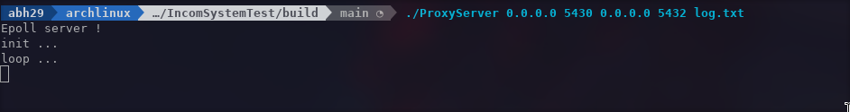
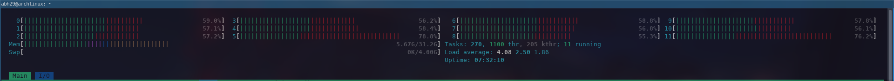
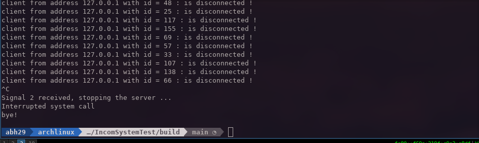
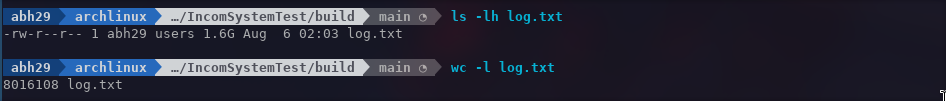
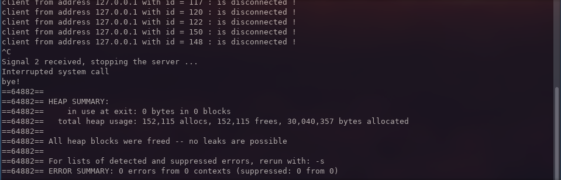
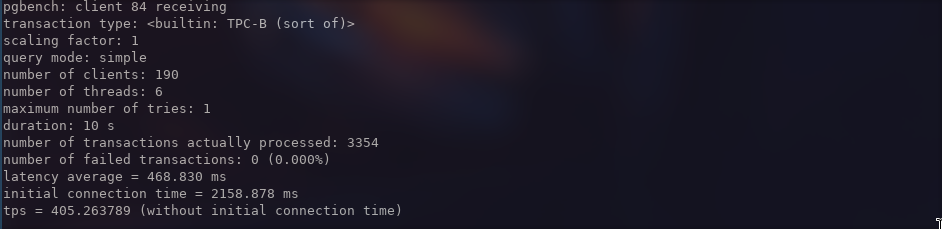
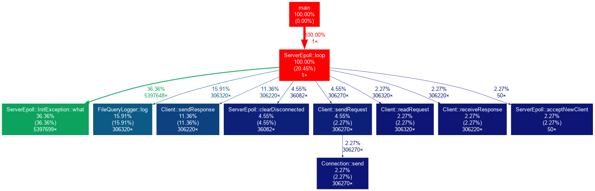

# IncomSystemTest
This is an implementation of a simple proxy server for logging posgtresql query messages.

## The Task 
To develop a TCP proxy server in C++ for the Postgresql DBMS with the ability to log all SQL queries passing through it. Documentation on the network protocol of this DBMS is available on the official website.

To complete the test task, you need to use Berkley sockets (select/poll/epoll).

There should be no other dependencies.

The proxy must be able to handle a large number of connections without creating a thread for each connection. It is necessary to parse the network packets passing through the proxy, which contain SQL queries, extract these queries from the packets and write them to a file as text (one query per line, the structure is unimportant). In order for SQL queries to be visible in the proxy in unencrypted form, SSL must be disabled (on the client and/or server). Minimal error handling should be present, and comments in places where errors are possible are also desirable. The application should not crash on several dozen simultaneous connections running queries to the DBMS without interruption for 5 minutes (you can use sysbench for testing). The Linux operating system, the compiler is GCC, you also need to create a file to build the project using cmake or make.

## The Implementation
This was implemented in a strait forward manner, using no dependencies other than the standard C++ library and the headers related to sockets (open/listen/connect) and epoll stuff, and these are the objects of the implementation:

### Connection
- A Connection object opens a connection fd with the database server through a socket, it has two main functions:
    - long send(const std::vector<char>& buffer) writes the content of the buffer to the connection socket.
    - long receive(const std::vector<char>& buffer, size_t max_len) reads the content of the connection socket to the buffer.
    - They both return the number of read/write bytes.

### ClientLogger
- is an interface providing a method void log(const Client::pointer &c); for logging the data from a client object.
- FileQueryLogger is an implementation of this interface, it logs the query messages saved in the client buffer to file. We can add other implementation for different logging logic or separate the logic in different threads.

### Client

- Each time a new incoming traffic to the server socket a new client object is added to the server
- Each client creates a Connection object that allows it to communicate with the remote server
- The client has a rotating logic with four steps (modes)
    1. the client sends a request to the proxy server
    2. the request is logged and sent to the remote server
    3. the remote server sends back a response
    4. the response is then sent back to the client
- In each iteration of the server's loop the mode is checked and changed accordingly

### Server

- Iserver is an interface defining the global shape of the server class:
    - a constructor that takes the ip (Ipv4 only) of the server and the DBserver and their 
        respective ports as well as shared pointer to a logger object.
    - void init(); initialize the server (open socket, open log file ...)
    - void loop(); the server start listening to incomming trafic and delling with it
    - void stop(); to stop the server
- I have added one implementations to this interface :
    - ServerEpoll is an implementation using the epoll api for Linux

## Additionally:

- The logging happens on the level of the server, since this is a response to a specific task where it is 
    required to log only the SQL-queries, for each incoming traffic from the client the first byte is checked
    if it equals 'Q' (simple query) or {'P', 'B', 'D', 'E', 'C', 'F'} (extended query) then the request is logged.
- This values are saved in a map that is filled in the init routine
- We can add other message types to the log (command, execute, error ....), we need to add the identifier (byte1)
    to the messageTypes map. (see: https://www.postgresql.org/docs/current/protocol-message-formats.html)

## Running and Testing the server

- starting the server at localhost on port 5430 with postgres already running at localhost on port 5432.

- a script is provided to stress test the server using sysbench, for this test I ran 150 threads for 5min.

- cpu usage during the test

- stopping the server.

- inspecting the log file.

- checking for leaks with valgrind.

- running other test with pgbench.

- profiling the server using gprof.

