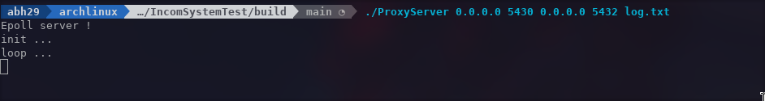
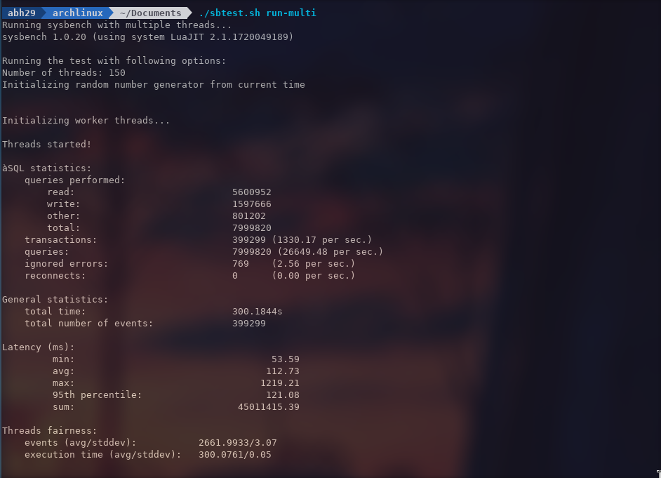
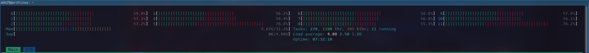
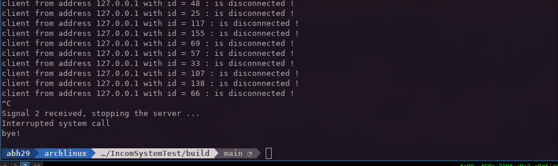
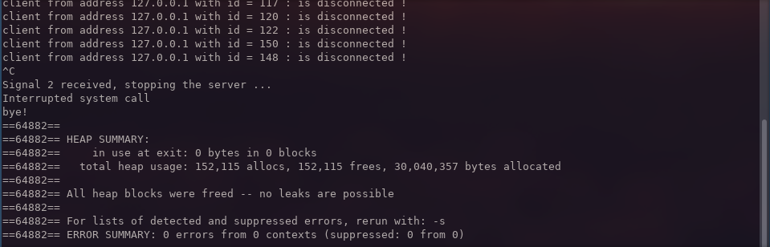
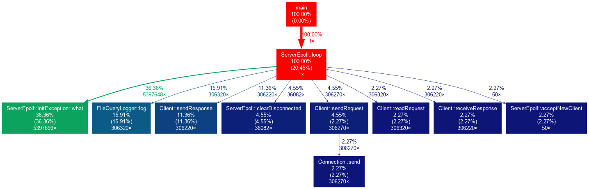

# IncomSystemTest
Это реализация простого прокси-сервера для регистрации сообщений с запросами postgresql.

## Задача
Разработать на C++ TCP прокси-сервер для СУБД Postgresql с возможностью логирования всех SQL запросов, проходящих через него. Документация по сетевому протоколу этой СУБД доступна на официальном сайте.

Для выполнения тестового задания нужно использовать Berkley sockets (select/poll/epoll).

Прочих зависимостей быть не должно.

Прокси должен уметь обрабатывать большое количество соединений без создания потока (thread) на каждое соединение. Необходимо распарсить сетевые пакеты, проходящие через прокси, в которых содержатся SQL запросы, извлечь эти запросы из пакетов и записать их в файл в виде текста (по одному запросу в строке, структура неважна). Для того, чтобы в прокси были видны SQL запросы в незашифрованном виде, необходимо отключить SSL (на клиенте и/или сервере). Должна присутствовать минимальная обработка ошибок, так же желательны комментарии в тех местах, где возможны ошибки. Приложение не должно падать на нескольких десятках одновременных соединений, выполняющих запросы к СУБД без перерыва в течение 5 минут (можно использовать sysbench для тестирования). Операционная система Linux, компилятор – GCC, так же необходимо создать файл для сборки проекта с помощью cmake или make.

## Реализация
Это было реализовано простым способом, без использования каких-либо зависимостей, кроме стандартной библиотеки C++ и заголовков, связанных с сокетами (open/listen/connect) и epoll, и это объекты реализации:

### Connection
- Объект Connection открывает fd соединения с сервером базы данных через сокет, он выполняет две основные функции:
    - длинная отправка (const std::vector<char>& buffer) записывает содержимое буфера в сокет соединения.
    - функция длительного приема(const std::vector<char>& buffer, size_t max_len) считывает содержимое сокета подключения в буфер.
    - Они оба возвращают количество байт для чтения/записи.

### ClientLogger
- это интерфейс, предоставляющий метод void log(const Client::pointer &c); для записи данных из клиентского объекта.
- - File Query Logger является реализацией этого интерфейса, он записывает сообщения запроса, сохраненные в клиентском буфере, в файл. Мы можем добавить другую реализацию для другой логики ведения журнала или разделить логику в разных потоках.

### Client
- Каждый раз, когда на серверный сокет поступает новый трафик, на сервер добавляется новый клиентский объект
- Каждый клиент создает объект подключения, который позволяет ему взаимодействовать с удаленным сервером
- Клиент имеет чередующуюся логику с четырьмя этапами (режимами).
    1. клиент отправляет запрос на прокси-сервер
    2. запрос регистрируется и отправляется на удаленный сервер
    3. удаленный сервер отправляет ответ
    4. затем ответ отправляется обратно клиенту
- На каждой итерации цикла работы сервера режим проверяется и изменяется соответствующим образом

### Server
- Server - это интерфейс, определяющий глобальную форму класса server:
    - - конструктор, который принимает ip (только Ipv4) сервера и сервера базы данных и их 
        соответствующие порты, а также общий указатель на объект logger.
    - void init(); инициализируем сервер (открываем сокет, открываем файл журнала ...)
    - - void loop(); сервер начинает прослушивать входящий трафик и обрабатывать его
    - void stop(); чтобы остановить сервер
- Я добавил одну реализацию в этот интерфейс :
    - - Сервер Epoll - это реализация, использующая epoll api для Linux

## Дополнительно:

- Логирование происходит на уровне сервера, поскольку это ответ на конкретную задачу, где
требуется логировать только SQL-запросы, для каждого входящего трафика от клиента проверяется первый байт
    если оно равно "Q" (простой запрос) или {"P", "B", "D", "F", "E", "C"} (расширенный запрос), то запрос регистрируется.
- Эти значения сохраняются в карте, которая заполняется в процедуре инициализации
- - Мы можем добавить в журнал другие типы сообщений (команда, выполнение, ошибка ....), нам нужно добавить идентификатор (байт 1)
    к карте типов сообщений. (смотрите: https://www.postgresql.org/docs/current/protocol-message-formats.html)

## Запуск и тестирование сервера

- запуск сервера на локальном хостинге через порт 5430 с postgres, который уже запущен на локальном хостинге через порт 5432.

- - предоставляется скрипт для стресс-тестирования сервера с помощью sysbench, для этого теста я запустил 150 потоков за 5 минут.

- загрузка процессора во время теста

- остановка сервера.

- проверка файла журнала.

- проверка на наличие утечек с помощью valgrind.

- запуск другого теста с помощью pgbench.

- профилирование сервера с помощью gprof.

